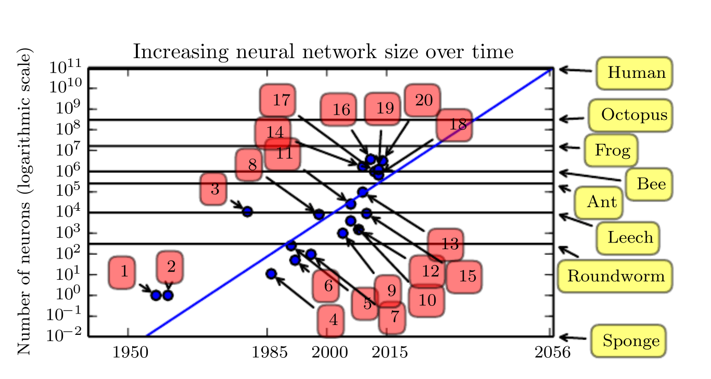

<!-- Other Notes

More data = less skill
Is converse true? Does more skill compensate for less data? Is there a ceiling to benefit achieved with skill?

 -->

\fullbleedpicture{img/AI_word_cloud.png}

---

\begin{tikzpicture}[overlay, remember picture,
textbox/.style={right, align=left, text=white, minimum width=3cm, text badly ragged},
shadedbox/.style={fill=black, fill opacity=0.4, text opacity=1.0}]

\newcommand{\tzsbullet}{{\tiny ${}^\blacksquare$}\ }

\node[at=(current page.center)] {\includegraphics[width=\paperwidth,height=\paperheight,keepaspectratio=false]{img/1010-street-view.png}};

\pause
% was -.965
\node[textbox, fill=black, fill opacity=0.4, text opacity=1.0, rounded corners, text=white] (A) at (page cs:-0.6, 0.89) {\Large Buying a House: How Much to Offer? };

\end{tikzpicture}

<!-- \node[textbox, shadedbox, below right] (pros) at (page cs:-.85, 0.6) {\large \bf Somethgin \textcolor{orange!70!white}{colored} \\
\tzsbullet Consideration \\
\tzsbullet Consideration \\
\tzsbullet Consideration \\
\tzsbullet Consideration \\
};
 -->

---

\fullbleedpicture{img/1010-zillow.png}

## Comparables

* Statistics: learning from data

* \callout{Descriptive} statistics: summarize with no interpretation

* \callout{Exploratory} data analysis (EDA): claims about current sample

## Generalizing Comparables

* Relevant comparables may not be available

* Extend limited data

* \callout{Predictive} modeling: estimate value for an \callout{out of sample} unit

* Buyer's perspective

## Understanding Comparables

* Seller's perspective: does an investment to

  - remodel the kitchen or

  - paint or

  - landscape or

  - add a bathroom or

  - make life easier for my broker

  make sense?

\bigskip

* \callout{Inferential} statistics

## Machine Learning (ML)

:::::: {.columns}
::: {.column width="50%"}

* \callout{Machine learning}: an algorithm allowing computer to build and improve a model from more \callout{data}

\pause
\bigskip

* GLMs
* Logistic regression
* Decision trees
* Exam \callout{MAS} material

\pause
\bigskip

* \callout{Not ML}: expert system, knowledge base

<!-- * Big question: form of input data? -->

:::
::: {.column width="50%"}

\pause

**ML Problems**

* Classification
* Regression
* Transcription
* Machine translation
* Anomaly detection
* Synthesis
* Impute missing values
* De-noise
* Density estimation

<!-- * Classification (with missing inputs)
* Regression, prediction
* Transcription (image to text)
* Machine translation
* Anomaly detection (fraud, spam)
* Synthesis (speech, synthetic landscape)
* Impute missing values
* De-noise
* Density estimation
 -->
:::
::::::

## Comparables...

\pause

* Encapsulate considerable domain expertise

\tagline{...and are a powerful data representation}

---

<!-- background rectangle/.style={fill=olive!45}, show background rectangle, -->

\begin{tikzpicture}[overlay, remember picture,
textbox/.style={right, align=left, text=white, minimum width=3cm, text badly ragged},
shadedbox/.style={fill=black, fill opacity=0.4, text opacity=1.0}]

\path[draw, fill, white] (page cs:-1,-1) rectangle (page cs:1,1);

\node[right, align=left, text badly ragged, text width=15cm, text=black]
  at (page cs:-0.965, 0.89)
  { \Large Three Houses in Same Town: Rank by Market Value   };

\node[below right] at (page cs:-0.95, 0.8) {\includegraphics[width=6cm,keepaspectratio=true]{img/house-895.png}};

\node[below right, white] at (page cs:-.93, 0.78) {\Large A};

\pause

\node[below right] at (page cs:0, 0.8) {\includegraphics[width=6cm,keepaspectratio=true]{img/house-319.png}};

\node[below right, black] at (page cs:0.02, 0.78) {\Large B};

\pause

\node[below right] at (page cs:-0.95, 0) {\includegraphics[width=6cm,keepaspectratio=true]{img/house-2790.png}};

\node[below right,  black] at (page cs:-0.93, -0.02) {\Large C};

\pause

\node[below right, align=left, black] at (page cs: 0.05, -0.2) {
\large 1) $A<B<C$ \\
\large 2) $B<A<C$ \\
\large 3) $B<C<A$ \\
\large 4) $C<B<A$ \\
\large 5) None of the above \\ \\ FYI, values are $x:3x:9x$};

\end{tikzpicture}

---

@@@include 60.010.Three_Homes.md

## Humans excel at image recognition...

* Humans can process images very quickly

  - The three images contain several \callout{megabytes} of data, $p\gg n$

* Computers can process structured text very quickly

  - The raw text contains a few \callout{kilobytes} of information

* Which system would you rather try to program?

<!-- 	- File sizes: 14.2MB using PNG lossless compressed format
	- Lower quality compressed PDF is 747KB

 	- File size: 11KB
	- Zip compressed 4KB
 -->

\tagline{...and many other problems computers find hard}

## Artificial Intelligence (AI)

:::::: {.columns}
::: {.column width="50%"}

* \callout{Artificial Intelligence}: solving problems people find easy but computers find hard

  * Image interpretation

  * Conversation

  * Reading emotions

  * Catching frisbees

\bigskip

* Skills shared with other animals having neuron-based brains

\bigskip

* AI is a \callout{problem domain}

:::
::: {.column width="50%"}

:::
::::::

## The Premise of AI...

Appears people have gotten a long way with a \callout{single} trick

\bigskip

* Recent studies suggests the mammalian brain uses a \callout{single algorithm} to solve most tasks

* Previously machine learning research fragmented: distinct approaches for natural language processing, vision, motion planning, speech recognition

\tagline{...today AI leverages a single general purpose algorithm  \\ inspired by, but not simulating, brain function \\ to solve a wide range of problems}

## AI General Purpose Algorithm

<!-- Goodfellow -->

* Learn \callout{model} from experience
  - Use machine learning
  - *Show don't tell* background information

\bigskip

* Learn what is \callout{important}
  - Data \callout{representation} created simultaneously with model

\bigskip

* Understand the world as a \callout{hierarchy of concepts}
  - Complicated concepts built out of simpler ones

\bigskip

* Hierarchy of concepts has many layers
  - \callout{Deep} learning

## AI General Purpose Algorithm...

:::::: {.columns}
::: {.column width="40%"}

* Hierarchy layers built using simple *neuron* nodes

* \callout{Neural networks} build new covariates from non-linear \callout{hinge} functions of existing covariates and the output of other layers

* Optimize overall fit with least squares

<!-- * Deep learning = neural network with many layers -->

:::
::: {.column width="60%"}

{width=100%}

\bigskip

\tagline{...algorithm inspired by our \\ understanding of brain function}

<!--
{width=100%}
 -->
:::
::::::

## AI General Purpose Algorithm: A Na&iuml;ve Description

* Neural networks and deep learning are fancy least squares
  - Solve using \callout{gradient descent} = walking downhill
  - Stochastic gradient descent = probably walking downhill

* Approximate complex functions by \callout{compositions of simple ones}

* Build and combine specialized problem solving nodes
  - recognize color...
  - recognize car vs truck vs bike vs motorcycle vs ...
  - can combine to recognize red car, blue truck, ...

* Pool, share and feedback information between nodes

* Nodes \callout{simultaneously} learn \callout{model} and data \callout{representation}

## AI Has a Long History...

| **Old Approach**                                | **New Approach **                                                 |
|:------------------------------------------------|:------------------------------------------------------------------|
| \callout{Knowledge base}: hard-coded knowledge about world | \callout{Machine Learning}: extract model from training data         |
|                                                 |                                                                   |
| \callout{Expert system}: humans decide important features | \callout{Representation Learning}: determine important factors of variation |
|                                                 |                                                                   |
| \callout{Neural networks}                       | \callout{Deep learning} neural networks            |

\tagline{...but hasn't always performed as expected}

## Why Is AI Working Now?

:::::: {.columns}
::: {.column width="35%"}

\bigskip

* Better algorithms

\bigskip

* More data

\bigskip

* Bigger models

:::
::: {.column width="65%"}

{width=100%}

:::
::::::

## Why AI Is Working Now: \callout{Better Algorithms}

Pre-2006 deep networks were believed to be very \callout{difficult to train}

* Better algorithms devised by Hinton in 2006 allowed deeper models by making them faster to train
* Beginning of the deep learning era
* Tens of thousands of researchers working in AI/ML

\bigskip

\pause

## Why AI Is Working Now: \callout{More Data}

* More data: IOT, Big Data, digitization of society

* \callout{More data = less skill} required to train model

* Goodfellow data rules of thumb: a supervised deep learning algorithm will generally

  - achieve \callout{acceptable} performance with around \callout{5,000} labeled examples per category
  - will match or \callout{exceed human} performance when trained with a dataset containing at least \callout{10 million} labeled examples

## Why AI Is Working Now: \callout{Bigger Models}

:::::: {.columns}
::: {.column width="50%"}

* Bigger = \callout{deeper} models
  - More computer power
  - Better algorithms

* Model size: \callout{connections} and \callout{number} of neurons or nodes

* Biological neurons not densely connected
  - Models within order of magnitude of mammal brains

* Number of neurons: current models are very small
  - Doubling every 2.4 years
  - \callout{Match human brain by 2050}

:::
::: {.column width="50%"}

\tagline{...can't expect much from a \\ leech-brain sized network}

:::
::::::

## Deep Learning Summary

:::::: {.columns}
::: {.column width="50%"}

\callout{Deep learning} is an approach to AI. Specifically, it is a type of machine learning, a technique that allows computer systems to improve with experience and data.

* ...machine learning is the \callout{only viable approach} to building AI systems that can operate in complicated, real-world environments

* Deep learning...achieves great power and flexibility by learning to represent the world as a \callout{nested hierarchy of concepts}

<!-- , with each concept defined in relation to simpler concepts, and more abstract representations computed in terms of less abstract ones.
\vfill\tiny

 Goodfellow, Ian, Yoshua Bengio, and Aaron Courville. Deep learning. MIT press, 2016.
 -->

:::
::: {.column width="50%"}

\small Central Park Dreamscape CGI

:::
::::::

## When Does AI Work Well?

:::::: {.columns}
::: {.column width="50%"}

**Stunning results**

\medskip

* Static, rules based environment
* Clean, direct observations
* Essentially limitless data
* Definitive right answer

\bigskip

**Examples**

* Classification problems
* Image, speech recognition
* Pedestrian detection
* \callout{Traffic sign classification}
<!-- * Neural Turing machines -->
* Simple dynamic control
* Reinforcement learning, robotics
* Synthetic data, alphaZero
* GANs

\pause

:::
::: {.column width="50%"}

**Characteristics of insurance**

\medskip

* Behavioral feedbacks
* Dynamic: reacts as we learn
* Proxy data, not direct
* \callout{Inherently small} classes
* Uncertain data: development
* Latent data <!-- : asbestos and environmental -->
<!-- * Need to protect social function -->

\vskip 0.5truein

\tagline{...AI works well on \\ real world data}

:::
::::::

## Real World Data

* \callout{No Free Lunch} Theorem for ML

\medskip

> Averaged over all possible data generating distributions, \callout{every} classification algorithm has the \callout{same error rate} on new data

* No machine learning algorithm is universally any better than any other

* The most sophisticated algorithm has the same average performance as predicting every point belongs to the same class

* ML ignores grim prognosis and finds rules that are probably correct most of the time

\tagline{...regardless, AI works well on real data}

## AI Assumptions About *Real Data*

:::::: {.columns}
::: {.column width="50%"}

* Real data often appears very high dimensional ($p\gg n$) but really contains \callout{hidden structure}

<!-- \bigskip

* Likes and shopping baskets
  - Matrix completion
  - Compressed sensing
 -->

\bigskip

* Photographs do not look like random images
  - Continuous: image near a photograph recognizable
  - No jumps or cliffs
  - Not fractal-like

:::
::: {.column width="50%"}

{height=70%}

\small Real images occupy a \callout{negligible proportion} of the
total volume of image space

:::
::::::

## AI Assumptions About *Real Data*

Helpful \callout{general purpose priors} or data rules of thumb

<!-- Goodfellow p. 556 and
Bengio, Yoshua, Aaron Courville, and Pascal Vincent. "Representation learning: A review and new perspectives." IEEE transactions on pattern analysis and machine intelligence 35.8 (2013): 1798-1828.

-->

## AI Assumptions About *Real Data*

\small

| **Assumption**                       | **Concerns**                  |
|:-------------------------------------|:------------------------------|
| \callout{Smoothness}                 | Weather, butterfly effect; singularities     |
|                                      |                               |
| Multiple explanatory factors         | Sudden change in relationship |
| \callout{Common material drivers}    | or sentiment                  |
| Shared factors across tasks          | Phase change or market crash                              |
| \callout{Hierarchical organization} of factors |                               |
|                                      |                               |
| Simple \callout{linear} factor dependencies   | Log-linear: earthquakes       |
|                                      |                               |
| \callout{Manifolds}: real data is low $d$      |                               |
| Natural clustering                   |                               |
| \callout{Sparsity},  80/20 explanatory rule    |                               |
|                                      |                               |
| Temporal and spatial \callout{coherence}       |                               |
| Causal factors                       | State dependent causality     |

## AI Applications: Everything

<!-- \pause

* Compare...

  ...Blockchain Applications: Nothing
 -->
## AI Applications: Well...Almost Everything

<!-- \pause

* Compare...

  ...Blockchain Applications: Well...Identity
 -->

## Insurance-Related AI Applications

:::::: {.columns}
::: {.column width="50%"}

**Good fit, already live**

* Marketing

* Customer service <!-- chatbox, call centers etc. -->

* Underwriting homogeneous classes = predictive modeling

* Claims processing

* Fraud detection

* Health care

:::
::: {.column width="50%"}

**Potential good fit**

* Claims reserving

* Loss reserving, see Brian...

* Data quality

* Anomaly detection

* Data completion

* Underwriting \callout{accounts} = detecting risk-aware management

* Risk management in high frequency lines

:::
::::::

## More Challenging for AI

:::::: {.columns}
::: {.column width="40%"}

**Data rules fail**

* Discontinuities

* State change

* Sentiment change

* Singularities: tornados, black holes

* Fractal data

* Butterfly effect

* Weather models

* Cat models

* Identify next mass tort

:::
::: {.column width="60%"}

\pause

**The Limits of Predictability**

* Observations = \callout{Trials} $\times$ \callout{Probability}

* For Observations $\ge 5000$...

  ...need Trials $\ge 5000 / \text{Probability}$

* For $p=0.001$ need Trials \callout{$\ge 5$ million}

* For $p=10^{-6}$ need Trials \callout{$\ge 5$ billion}

\vskip 0.5truein

* For $p\approx 0.01$ see plenty of examples on r/CatastrophicFailure, r/IdiotsInCars, r/nononono, r/OSHA, r/Roadcam

:::
::::::

## AI Compared to Catastrophe and Weather Models

:::::: {.columns}
::: {.column width="50%"}

* Given Observations = Trials $\times$ Probability...is enough data \callout{practically possible}?

\bigskip

* Weather and catastrophe models are physics-based models

* Physical models better than a learned phenomenological models

* Re-learning physics inefficient

* AI can work effectively in \callout{conjunction} with physics-based models

:::
::: {.column width="50%"}

\vskip 0.5truein
y
\tagline{...AI already being applied to \\ forecast high impact \\ weather events }

:::
::::::

---

\begin{tikzpicture}[overlay, remember picture,
textbox/.style={below,
              align=left,
              text=white,
              minimum width=3cm,
              text badly ragged,
              fill=black,
              fill opacity=0.4,
              text opacity=1.0},
shadedbox/.style={fill=black,
              fill opacity=0.4,
              text opacity=1.0,
              rounded corners}]

\newcommand{\tzsbullet}{{\tiny ${}^\blacksquare$}\ }

\node[at=(current page.center)] {\includegraphics[width=\paperwidth,height=\paperheight,keepaspectratio=false]{img/raw-data-is-an-oxymoron.png}};

\node[textbox] (A) at (page cs:0, 0.85) {\Large  ``\callout{Raw data} is both an oxymoron and a bad idea; \\ \Large to the contrary, data should be cooked with care.'' \\ \footnotesize Geoffrey Bowker  };

\node[textbox, shadedbox, below right] (pros) at (page cs:-0.1, -.30) {\large \bf Message so Far \\
\tzsbullet Show don't tell \\
\tzsbullet Input training data \\
\tzsbullet Derive data \callout{representation}  \\
\tzsbullet Derive \callout{model} relationships };

\end{tikzpicture}

## AI Bias and Sources of Modeling Failure

* Computers do not see images with semantic understanding
* Computers see things the eye cannot detect: lighting, type of camera
* Computers don't filter irrelevant information

* Basic statistics emphasizes training data must be a \callout{random cross section} of population
  - Extend to include new characteristic picked up by ML

* Skills for AI modeling era
  - Enhanced methodological rigor \callout{managing training data}
  - Technical tools to analyze and diagnose the \callout{behavior} of the model
  - Training, education and caution in the \callout{deployment} of ML in products

## AI Bias and Sources of Modeling Failure

* How do the models fail?
  - Technical problem inherent in algorithm
  - Bad implementation
  - Institutional failure by large bureaucracy

\bigskip

* Understanding decisions in big organization very complex
  - Like evaluating ML models people are black boxes too

\tagline{...AI is just a machine---think washing machine \\ not HAL9000---powerful but limited \\ \tiny \textcolor{white}{Benedict Evans} }

<!-- I often think that the term ‘artificial intelligence’ is deeply unhelpful in conversations like this. It creates the largely false impression that we have actually created, well, intelligence - that we are somehow on a path to HAL 9000 or Skynet - towards something that actually understands. We aren’t. These are just machines, and it’s much more useful to compare them to, say, a washing machine. A washing machine is much better than a human at washing clothes, but if you put dishes in a washing machine instead of clothes and press start, it will wash them. They’ll even get clean. But this won’t be the result you were looking for, and it won’t be because the system is biased against dishes. A washing machine doesn’t know what clothes or dishes are - it’s just a piece of automation, and it is not conceptually very different from any previous wave of automation. -->

<!-- https://prezi.com/ktz-4hw2qbly/raw-data-pure-data-databodies-and-data-worlds/
Benedict Evans blog

* Computers do not see images with semantic understanding
  - Detect type of camera, notice background
  - Can't look inside model to see how it's working
* Training data must include random cross section of population = basic statistics (small sample problems don't go away with big data they get worse)
  - Must **not** include non-human characteristic picked up by ML (need to learn what these are; may not be visible; see lighting)
  - Avoid ethically dubious or illegal predictors---can you tell if they are used or proxied?
  - Applies to more than people

* Solutions
  1. Methodological rigor in the collection and management of the training data
  2. Technical tools to analyze and diagnose the behavior of the model
  3. Training, education and caution in the deployment of ML in products

* Example: problem with inflexible SQL-based systems
  - Technical problem inherent with SQL?
  - Problem with implementation of your database?
  - Institutional failure by large bureaucracy?

* Understanding decisions in big organization very complex, like evaluating ML models ``people are black boxes too''
* AI just a machine---think washing machine not HAL9000---powerful but limited

 -->

@@@include 60.010.Cheat_Sheet.md

## Practical

* OS: any OS will do, I'm using Ubuntu
* Cloud
    * AWS
    * Azure
* Frontend
    * R/Keras
    * Python
    * Others
*  Backend
    * Tensorflow
    * Theano
    * CNTK

## Hardware

> ``What happened is that the gaming market subsidized supercomputing for the next generation of artificial intelligence applications.''

> JJ Allaire and François Chollet

## An Example

## Example Summary

> ``[I]t’s a simple mechanism that, once scaled, ends up looking like magic.''

> JJ Allaire and François Chollet

* Setting up an AI workstation may be easier than you think!
* For a very simple set of predictors, AI offers compelling performance results. Imagine what can be done with more granular data and more thought.
* The actuary tunes the construction of the model by establishing the predictor space, number of layers, hidden layers, &c.
* The box is very black. More work to be done here.
* Performance metrics and comparisons to traditional models can support our understanding of what we're doing.

## References

\tiny

| Slide(s)        | Reference                                                                                                                                                                                                                                                  |
|:-------------------|:----------------------------------------------------------------------------------------------------------------------------------------------------------------------------------------------------------------------------------------------|
| 3,4,10,11    | https://www.zillow.com                                                                                                                                                                                                                                     |
| 13-16, 21-23, 25-26 | Goodfellow, Ian, Yoshua Bengio, and Aaron Courville. Deep learning. MIT press, (2016). https://deeplearningbook.org                                                                                                                                        |
| 19           | Godfathers of AI, The Verge 2019, https://www.theverge.com/2019/3/27/18280665/ai-godfathers-turing-award-2018-yoshua-bengio-geoffrey-hinton-yann-lecun                                                                                                     |
| 20, 27       | Google Scholar
| 27-28      | Bengio, Yoshua, Aaron Courville, and Pascal Vincent. "Representation learning: A review and new perspectives." IEEE transactions on pattern analysis and machine intelligence 35.8 (2013): 1798-1828. https://arxiv.org/pdf/1206.5538.pdf                  |
| 33      | McGovern, Amy, et al. "Using artificial intelligence to improve real-time decision-making for high-impact weather." Bulletin of the American Meteorological Society 98.10 (2017): 2073-2090. https://journals.ametsoc.org/doi/pdf/10.1175/BAMS-D-16-0123.1 |
| 34      | Anna Munster, Raw data, pure data, databodies, and data worlds (2017)  https://prezi.com/ktz-4hw2qbly/raw-data-pure-data-databodies-and-data-worlds/                                                                                                       |
| 35-36      | Benedict Evans, Notes on AI Bias (2019) https://www.ben-evans.com/benedictevans/2019/4/15/notes-on-ai-bias                                                                                                                                                      |

\bigskip

:::::: {.columns}
::: {.column width="50%"}

\fontsize{0.14cm}{0.15cm}\selectfont

    ## May 2019 for CAS talk AI buzzword bingo image
    from imageio import imread
    import matplotlib.pyplot as plt
    from wordcloud import WordCloud
    import numpy as np

    args = {'width':3600, 'height':2400, 'max_words': 200,
            'max_font_size':240, 'relative_scaling' : 0.4,
            'background_color' : 'white', 'prefer_horizontal':0.75}

    words =['Artificial Intelligence', 'Big Data',
     'Causal Analysis', 'Data Represenatation', 'Data Visualization',
     'Deep Learning', 'Data Representation', 'Data Science'
     'Expert System', 'Exploratory Data Analysis', 'Inference',
     'Machine Learning', 'Neural Network', 'Predictive Analytics',
     'p > n', 'Statistics']

:::
::: {.column width="50%"}

\fontsize{0.14cm}{0.15cm}\selectfont

    word_freqs = { w: (0.4 + 0.6 * np.random.rand()) for w in words}
    word_freqs['Artificial Intelligence'] = 2.5
    word_freqs['Deep Learning'] = 1.5
    word_freqs['Neural Network'] = 1.5

    wordcloud = WordCloud(colormap=plt.cm.magma, **args)

    for i in range(30):
            wordcloud.generate_from_frequencies(word_freqs)
            plt.figure(figsize=(11,8.5))
            plt.imshow(wordcloud)
            plt.axis("off")
            plt.savefig(f'word_cloud_{i}.png', dpi=300)
            plt.show()

:::
::::::

