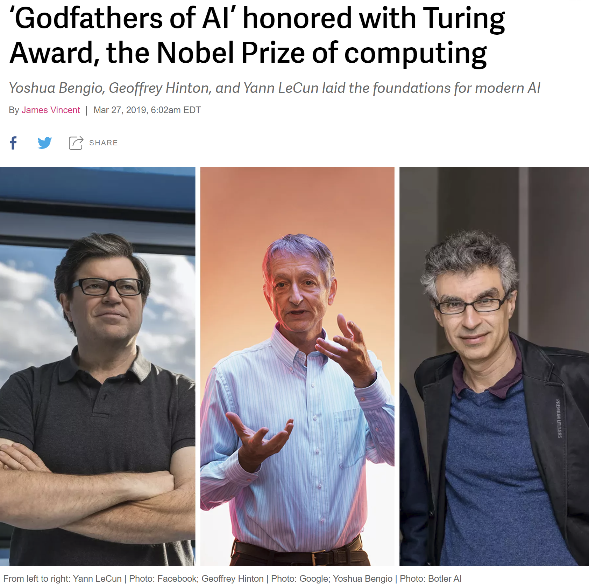

\fullbleedpicture{img/AI_word_cloud.png}

---

\fullbleedpicture{img/1010-street-view.png}

---

\begin{tikzpicture}[overlay, remember picture,
textbox/.style={right, align=left, text=white, minimum width=3cm, text badly ragged},
shadedbox/.style={fill=black, fill opacity=0.4, text opacity=1.0}]

\newcommand{\tzsbullet}{{\tiny ${}^\blacksquare$}\ }

\node[at=(current page.center)] {\includegraphics[width=\paperwidth,height=\paperheight,keepaspectratio=false]{img/1010-street-view.png}};

\pause
% was -.965
\node[textbox, fill=black, fill opacity=0.4, text opacity=1.0, rounded corners, text=white] (A) at (page cs:-0.6, 0.89) {\Large House Buying: How Much Should You Offer? };

\end{tikzpicture}

<!-- \node[textbox, shadedbox, below right] (pros) at (page cs:-.85, 0.6) {\large \bf Somethgin \textcolor{orange!70!white}{colored} \\
\tzsbullet Consideration \\
\tzsbullet Consideration \\
\tzsbullet Consideration \\
\tzsbullet Consideration \\
};
 -->

---

\fullbleedpicture{img/1010-zillow.png}

## Comparables

* \callout{Descriptive} statistics summarize with no interpretation

* \callout{Exploratory} data analysis (EDA): only makes claims about current sample

## Extending Comparables

* \callout{Predictive} modeling or analytics: estimating value for a **new** unit

* Buyer's perspective

* Leverage limited data

## Understanding Comparables

* Seller's perspective: should I invest to remodel the kitchen or paint or landscape or make life easier for my broker?

* \callout{Inferential} statistics

## Machine Learning (ML)

:::::: {.columns}
::: {.column width="50%"}

* Statistics is learning from data

* \callout{Machine learning} is an algorithm allowing computer to extract and improve model from raw data

\pause

* Predictive and inferential statistics are machine learning

* Logistic regression, decision trees, GLMs...what you use everyday

* Generally an expert system or knowledge base is **not** ML

* Big question: form of input data?

* Exam MAS material

:::
::: {.column width="50%"}

\pause

\callout{Examples of ML Problems}

* Classification (with missing inputs)
* Regression, prediction
* Transciption (image to text)
* Machine translation
* Anomaly detection (fraud, spam)
* Synthesis (speech, synthetic landscape)
* Impute missing values
* Denoise
* Density estimation

:::
::::::

---

<!-- background rectangle/.style={fill=olive!45}, show background rectangle, -->

\begin{tikzpicture}[overlay, remember picture,
textbox/.style={right, align=left, text=white, minimum width=3cm, text badly ragged},
shadedbox/.style={fill=black, fill opacity=0.4, text opacity=1.0}]

\path[draw, fill, white] (page cs:-1,-1) rectangle (page cs:1,1);

\node[right, align=left, text badly ragged, text width=15cm, text=black]
  at (page cs:-0.965, 0.89)
  { \Large Rank Three Houses in Same Town by Market Value   };

\node[below right] at (page cs:-0.95, 0.8) {\includegraphics[width=6cm,keepaspectratio=true]{img/house-895.png}};

\node[below right, white] at (page cs:-.93, 0.78) {\Large A};

\pause

\node[below right] at (page cs:0, 0.8) {\includegraphics[width=6cm,keepaspectratio=true]{img/house-319.png}};

\node[below right, black] at (page cs:0.02, 0.78) {\Large B};

\pause

\node[below right] at (page cs:-0.95, 0) {\includegraphics[width=6cm,keepaspectratio=true]{img/house-2790.png}};

\node[below right,  black] at (page cs:-0.93, -0.02) {\Large C};

\pause

\node[below right, align=left, black] at (page cs: 0.05, -0.2) {
\large 1) $A<B<C$ \\
\large 2) $B<A<C$ \\
\large 3) $B<C<A$ \\
\large 4) $C<B<A$ \\
\large 5) None of the above \\ \\ FYI, values are $x:3x:9x$};

\end{tikzpicture}

---

@@@include 60.010.Three_Homes.md

## Humans Excel at Image Recognition...

* Humans: very fast image processing

  - The three images contain several \callout{megabytes} of data, $n\ll p$

* Computers: very fast text processing

  - The raw text contains a few \callout{thousand} bytes information

* Which system would you rather try to program?

<!-- 	- File sizes: 14.2MB using PNG lossless compressed format
	- Lower quality compressed PDF is 747KB
 -->

<!-- 	- File size: 11KB
	- Zip compressed 4KB
 -->

\tagline{...and many other problems computers find hard}

## Artificial Intelligence (AI)

:::::: {.columns}
::: {.column width="50%"}

* \callout{Artificial Intelligence}: solving problems people find easy but computers find hard

  * Image recognition

  * Conversation, spoken words

  * Driving

  * Reading emotions

* Skills shared with other animals having neuron-based brains

\bigskip

* AI is a \callout{problem domain}

:::
::: {.column width="50%"}

:::
::::::

## The Premise of AI

**People have gotten a long way with a single algorithm**

\bigskip

* Studies suggests that much of the mammalian brain uses a \callout{single algorithm} to solve most tasks

* Before this hypothesis, machine learning research was more fragmented, with different communities of researchers studying natural language processing, vision, motion planning and speech recognition

* Deep learning taps this single, powerful general problem solving paradigm

* Deep learning is inspired by brain function, not simulating brain function

## Current AI Assumptions

<!-- Goodfellow -->

* Learn \callout{model} from experience
  - Use machine learning
  - Show don't tell the background needed for everyday life

\bigskip

* Understand the world as a \callout{hierarchy of concepts}
  - Learn complicated concepts by building out of simpler ones

\bigskip

* Learn what is important
  - Learn the \callout{data representation} and the model

\bigskip

* Graph of concepts generally has many layers
  - Hence \callout{deep} learning

\tagline{\qquad\qquad Miracle of AI: the same general purpose tool works for a wide range of problems}

## Current AI Tools...

:::::: {.columns}
::: {.column width="40%"}

* Layers built using simple ``neuron'' on/off nodes

* \callout{Neural networks} build new covariates from non-linear \callout{hinge} functions of existing covariates and output of other layers

* Optimize overall fit with least squares

:::
::: {.column width="60%"}

{width=100%}

\bigskip

\tagline{...follow our understanding of brain function}

<!--
{width=100%}
 -->
:::
::::::

## Current AI Tools: The Na&iuml;ve View

* Neural networks and deep learning are fancy least squares and gradient descent = walking downhill
  - Stochastic gradient descent = probably walking downhill

* Build complex functions from \callout{compositions of simple ones}

* Built specialized problem solving widgets
  - recognize color
  - recognize car vs truck vs bike vs motorcycle vs person
  - can combine to recognize red car, blue truck, ...

* Pool, share and feedback information between widgets

* Widgets learn model and appropriate data representation

## Deep Learning

:::::: {.columns}
::: {.column width="50%"}

\callout{Deep learning}  is an approach to AI. Specifically, it is a **type of machine learning**, a technique that allows computer systems to improve with experience and data.

* ...machine learning is the \callout{only viable approach} to building AI systems that can operate in complicated, real-world environments

* Deep learning...achieves great power and flexibility by learning to represent the world as a \callout{nested hierarchy of concepts}

<!-- , with each concept defined in relation to simpler concepts, and more abstract representations computed in terms of less abstract ones.
\vfill\tiny

 Goodfellow, Ian, Yoshua Bengio, and Aaron Courville. Deep learning. MIT press, 2016.
 -->

:::
::: {.column width="50%"}

:::
::::::

## AI has a Long History...

| **Old Approach**                                | **New Approach **                                                 |
|:------------------------------------------------|:------------------------------------------------------------------|
| \callout{Knowledge base}: hard code knowledge about world | \callout{Machine Learning}: extract model from          |
|                                                 |                                                                   |
| \callout{Expert system}: humans decide important features | \callout{Representation Learning}: determine important factors of variation |
|                                                 |                                                                   |
| \callout{Neural networks}                       | Deeper \callout{neural networks} trained with more data           |

\tagline{...but hasn't always performed as expected}

## Why Is AI Working Now?

:::::: {.columns}
::: {.column width="30%"}

* Better algorithms

* More data

* Bigger models

:::
::: {.column width="70%"}

{width=100%}

:::
::::::

## Why AI Is Working Now: Better Algorithms

Pre-2006 deep networks were believed to be very \callout{difficult to train}

* Better algorithms devised by Hinton in 2006 allowed deeper models by making them faster to train
* Beginning of the deep learning era
* Tens of thousands of researchers working in AI/ML

\bigskip

\pause

## Why AI Is Working Now: More Data

* More data: IOT, Big Data, digitization of society

* \callout{More data = less skill} required to train model

* Goodfellow data rules of thumb: a supervised deep learning algorithm will generally

  - achieve acceptable performance with around 5,000 labeled examples per category
  - will match or exceed human performance when trained with a dataset containing at least 10
    million labeled examples

## Why AI Is Working Now: Bigger Models

* Bigger models enabled by greater computational power and better algorithms

* Model size/depth: \callout{connections} and \callout{number} of neurons or nodes

* Biological neurons not densely connected
  - Models within order of magnitude of mammal brains connections

* Number of neurons: current models are very small
  - Doubling every 2.4 years
  - Will not match human brain until **2050**

\tagline{Can't expect much from a leech-brain sized network}

## When does AI Work Well?

:::::: {.columns}
::: {.column width="50%"}

**Stunning results when**

\medskip

* Static, rules based environment
* Clean, direct observations
* Essentially limitless data
* Definitive right answer
* Classification problems
* Simple dynamic control

\bigskip

**For example**

* Image, speech recognition
* Pedestrian detection
* Traffic sign classification
<!-- * Neural Turing machines -->
* Reinforcement learning, robotics
* GANs

\pause

:::
::: {.column width="50%"}

**Characteristics of insurance**

\medskip

* Behavioral feedbacks
* Dynamic: reacts as we learn
* Proxy data, not direct
* Granularity drives small classes
* Uncertain information: claim development, trend
* Latency: asbestos and environmental
* Most of the time not good enough
<!-- * Need to protect social function -->

:::
::::::

## Real World Data

* \callout{No Free Lunch} Theorem for ML

\medskip

> Averaged over **all** possible data generating distributions, \callout{every} classification algorithm has the \callout{same error rate} on new data

* No machine learning algorithm is universally any better than any other

* The most sophisticated algorithm has the same average performance as predicting every point belongs to the same class

* Despite grim prognosis ML finds rules that are probably correct most of the time

\tagline{ML builds tools that work well on real data}

## AI Assumptions About *Real Data*

:::::: {.columns}
::: {.column width="50%"}

* Real data often appears very high dimensional ($p\gg n$) but really contains \callout{hidden structure}

<!-- \bigskip

* Likes and shopping baskets
  - Matrix completion
  - Compressed sensing
 -->

\bigskip

* Photographs do not look like random images
  - Continuous: get an image near an image
  - No jumps or cliffs

:::
::: {.column width="50%"}

{height=70%}

Real images occupy a negligible proportion of the
volume of image space

:::
::::::

## AI Assumptions About *Real Data*

Helpful \callout{general purpose priors} or data rules of thumb

<!-- Goodfellow p. 556 and
Bengio, Yoshua, Aaron Courville, and Pascal Vincent. "Representation learning: A review and new perspectives." IEEE transactions on pattern analysis and machine intelligence 35.8 (2013): 1798-1828.

-->

## AI Assumptions About *Real Data*

\scriptsize

| **Assumption**                       | **Concerns**                  |
|:-------------------------------------|:------------------------------|
| Smoothness: functions are smooth     | Weather, butterfly effect; singularities     |
|                                      |                               |
| Multiple explanatory factors         | Sudden change in relationship |
| Common material drivers              | Market crash                  |
| Shared factors across tasks          |                               |
| Hierarchical organization of factors |                               |
|                                      |                               |
| Simple factor dependencies, linear   | Log-linear: earthquakes       |
|                                      |                               |
| Manifolds: real data is low $d$      |                               |
| Natural clustering                   |                               |
| Sparsity,  80/20 explanatory rule    |                               |
|                                      |                               |
| Temporal and spatial coherence       |                               |
| Causal factors                       | State dependent causality     |
|                                      |                               |
| *Most of the time*                   | ...there are no claims        |

## AI Applications: Everything

## Insurance-Related Applications

:::::: {.columns}
::: {.column width="50%"}

**Good Fit---Already Live**

* Marketing

* Customer service <!-- chatbox, call centers etc. -->

* Underwriting homogeneous classes = predictive modeling

* Fraud detection

* Claims processing: identify complex claims

* Healthcare

:::
::: {.column width="50%"}

**Potentially Good Fit**

* Claims reserving, see Brian...

* Loss reserving

* Data quality

* Anomaly detection

* Data completion

* Underwriting \callout{accounts} = detecting risk-aware management

* Risk management in high frequency lines

:::
::::::

## More Challenging for AI

:::::: {.columns}
::: {.column width="40%"}

**Challenge Data Rules of Thumb**

* Discontinuities

* State change, sentiment change

* Singularities: tornados, black holes

* Weather model

* Cat model

* Identify next mass tort

:::
::: {.column width="60%"}

**The Limits of Predictability**

* Frequency = \callout{Trials} $\times$ \callout{Probability}

* Materiality race between Trials and Probability

* More trials lowers observable probability threshold = Big Data helping

* r/CatastrophicFailure, r/IdiotsInCars, r/nononono, r/OSHA, r/Roadcam

:::
::::::

## AI Compared to Catastrophe and Weather Models

:::::: {.columns}
::: {.column width="50%"}

* Frequency = \callout{Trials} $\times$ \callout{Probability} again...given enough data...

* Weather and catastrophe models are physics-based models

* AI works most effectively \callout{in conjunction} with physics-based models to avoid re-learning physics: a physical model is better than a learned phenomenological model

* AI already being applied to high impact weather forecasting

:::
::: {.column width="50%"}

:::
::::::

---

\begin{tikzpicture}[overlay, remember picture,
textbox/.style={below right,
              align=left,
              text=white,
              minimum width=3cm,
              text badly ragged,
              fill=black,
              fill opacity=0.4,
              text opacity=1.0},
shadedbox/.style={fill=black,
              fill opacity=0.4,
              text opacity=1.0,
              rounded corners}]

\newcommand{\tzsbullet}{{\tiny ${}^\blacksquare$}\ }

\node[at=(current page.center)] {\includegraphics[width=\paperwidth,height=\paperheight,keepaspectratio=false]{img/raw-data-is-an-oxymoron.png}};

\node[textbox] (A) at (page cs:-.9, 0.85) {\Large  ``Raw data is both an oxymoron and a bad idea; \\ \Large to the contrary, data should be cooked with care.'' \\ \footnotesize Geoffrey Bowker  };

\node[textbox, shadedbox, below right] (pros) at (page cs:0, -.30) {\large \bf Message so Far \\
\tzsbullet Show don't tell \\
\tzsbullet Give data and results \\
\tzsbullet Derive data representation  \\
\tzsbullet Derive model relationships };

\end{tikzpicture}

## AI Bias and Sources of Modeling Failure

* Computers do not see images with semantic understanding
* Computers ``see'' things we cannot detect, lighting, type of camera and are not attuned to
* Computers don't filter ``irrelevant'' information, background

* Basic statistics: Training data must include random cross section of population
  - Extended to include non-human characteristic picked up by ML

* Solutions
  1. Methodological rigor in the collection and management of the training data
  2. Technical tools to analyze and diagnose the behavior of the model
  3. Training, education and caution in the deployment of ML in products

## AI Bias and Sources of Modeling Failure

* Problem domain
  - Technical problem inherent with algorithm?
  - Problem with implementation?
  - Institutional failure by large bureaucracy?

* Understanding decisions in big organization very complex
  - Like evaluating ML models ``people are black boxes too''

* AI is just a machine---think washing machine not HAL9000---powerful but limited

<!-- https://prezi.com/ktz-4hw2qbly/raw-data-pure-data-databodies-and-data-worlds/
Benedict Evans blog

* Computers do not see images with semantic understanding
  - Detect type of camera, notice background
  - Can't look inside model to see how it's working
* Training data must include random cross section of population = basic statistics (small sample problems don't go away with big data they get worse)
  - Must **not** include non-human characteristic picked up by ML (need to learn what these are; may not be visible; see lighting)
  - Avoid ethically dubious or illegal predictors---can you tell if they are used or proxied?
  - Applies to more than people

* Solutions
  1. Methodological rigor in the collection and management of the training data
  2. Technical tools to analyze and diagnose the behavior of the model
  3. Training, education and caution in the deployment of ML in products

* Example: problem with inflexible SQL-based systems
  - Technical problem inherent with SQL?
  - Problem with implementation of your database?
  - Institutional failure by large bureaucracy?

* Understanding decisions in big organization very complex, like evaluating ML models ``people are black boxes too''
* AI just a machine---think washing machine not HAL9000---powerful but limited

 -->

@@@include 60.010.Cheat_Sheet.md

## References

\tiny

| Slide | Reference                                                                                                                                                                                                                                                  |
|:------|:-----------------------------------------------------------------------------------------------------------------------------------------------------------------------------------------------------------------------------------------------------------|
|       | https://www.zillow.com                                                                                                                                                                                                                                     |
|       | Godfathers of AI, The Verge 2019, https://www.theverge.com/2019/3/27/18280665/ai-godfathers-turing-award-2018-yoshua-bengio-geoffrey-hinton-yann-lecun                                                                                                     |
|       | Goodfellow, Ian, Yoshua Bengio, and Aaron Courville. Deep learning. MIT press, (2016). https://deeplearningbook.org                                                                                                                                        |
|       | Bengio, Yoshua, Aaron Courville, and Pascal Vincent. "Representation learning: A review and new perspectives." IEEE transactions on pattern analysis and machine intelligence 35.8 (2013): 1798-1828. https://arxiv.org/pdf/1206.5538.pdf                  |
|       | Ben Evans, Notes on AI Bias (2019) https://www.ben-evans.com/benedictevans/2019/4/15/notes-on-ai-bias                                                                                                                                                      |
|       | Anna Munster, Raw data, pure data, databodies, and data worlds (2017)  https://prezi.com/ktz-4hw2qbly/raw-data-pure-data-databodies-and-data-worlds/                                                                                                       |
|       | McGovern, Amy, et al. "Using artificial intelligence to improve real-time decision-making for high-impact weather." Bulletin of the American Meteorological Society 98.10 (2017): 2073-2090. https://journals.ametsoc.org/doi/pdf/10.1175/BAMS-D-16-0123.1 |

\bigskip

:::::: {.columns}
::: {.column width="50%"}

\fontsize{0.14cm}{0.15cm}\selectfont

    ## May 2019 for CAS talk AI buzzword bingo image
    from imageio import imread
    import matplotlib.pyplot as plt
    from wordcloud import WordCloud, STOPWORDS, ImageColorGenerator
    import numpy as np

    args = {'width':3600, 'height':2400, 'max_words': 200,
            'max_font_size':240, 'relative_scaling' : 0.4,
            'background_color' : 'white', 'prefer_horizontal':0.75}

    words =['Artificial Intelligence', 'Big Data',
     'Causal Analysis', 'Data Represenatation', 'Data Visualization',
     'Deep Learning', 'Data Representation', 'Data Science'
     'Expert System', 'Exploratory Data Analysis', 'Inference',
     'Machine Learning', 'Neural Network', 'Predictive Analytics',
     'p > n', 'Statistics']

:::
::: {.column width="50%"}

\fontsize{0.14cm}{0.15cm}\selectfont

    word_freqs = { w: (0.4 + 0.6 * np.random.rand()) for w in words}
    word_freqs['Artificial Intelligence'] = 2.5
    word_freqs['Deep Learning'] = 1.5
    word_freqs['Neural Network'] = 1.5

    wordcloud = WordCloud(colormap=plt.cm.magma, **args)

    for i in range(30):
            wordcloud.generate_from_frequencies(word_freqs)
            plt.figure(figsize=(11,8.5))
            plt.imshow(wordcloud)
            plt.axis("off")
            plt.savefig(f'word_cloud_{i}.png', dpi=300)
            plt.show()

:::
::::::

